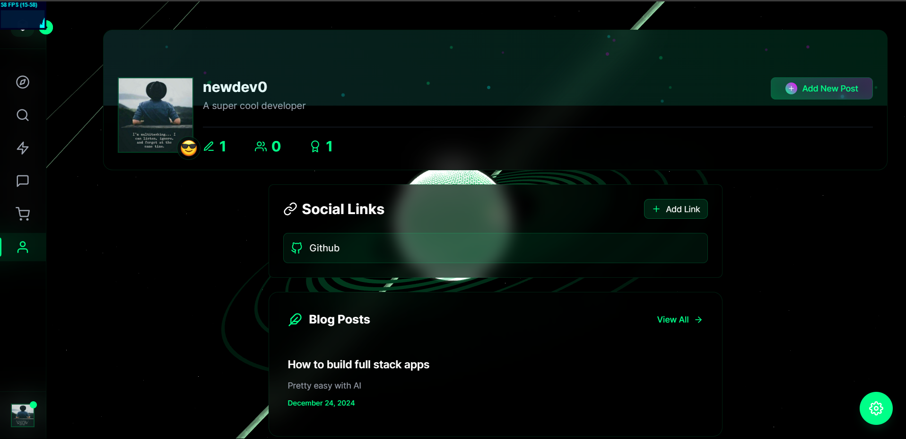
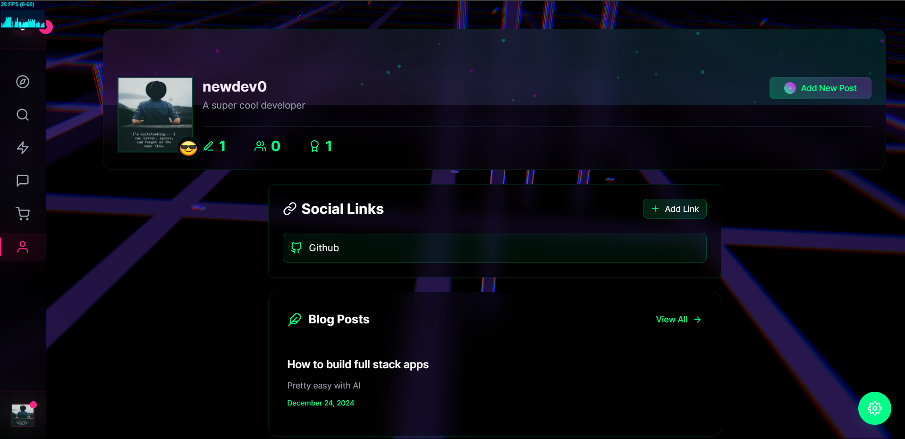
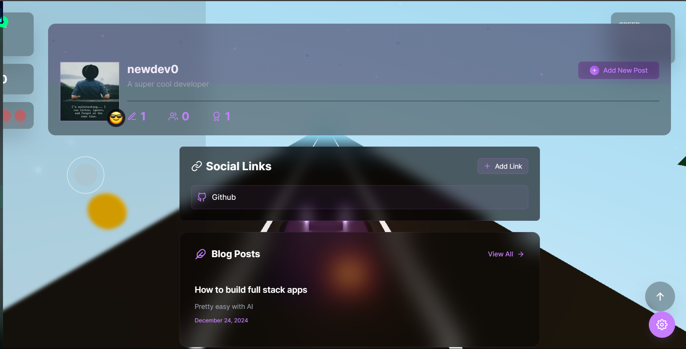
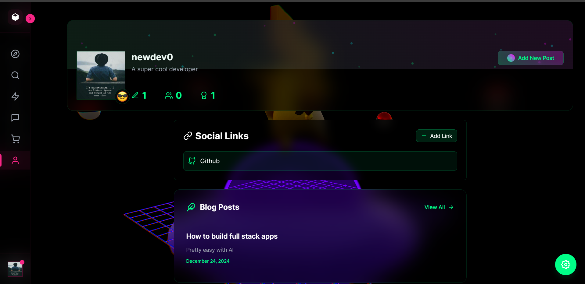
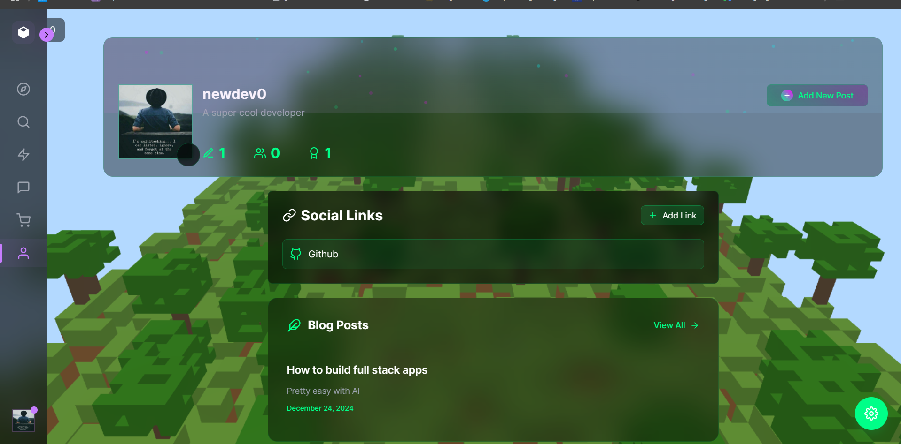
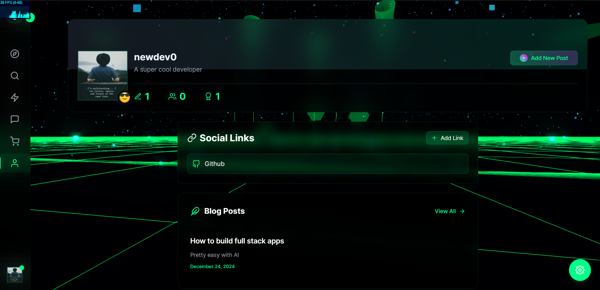

# Minebox: 3D Social platform which is personal

A 3D social platform with immersive fantasy worlds, real-time messaging, and RPG progression. Built with Three.js, React, and WebGL for an unforgettable social experience.

  <a href="https://minebox.newdev0.me" style="display: inline-block; padding: 12px 24px; background: linear-gradient(135deg, #4F46E5, #6366F1); color: white; text-decoration: none; border-radius: 8px; font-weight: 600; box-shadow: 0 4px 6px -1px rgba(79, 70, 229, 0.2); transition: all 0.2s;">
    Open MineBox
  </a>
  <a href="https://minebox.newdev0.me/newdev0" style="display: inline-block; padding: 12px 24px; background: linear-gradient(135deg, #22C55E, #16A34A); color: white; text-decoration: none; border-radius: 8px; font-weight: 600; box-shadow: 0 4px 6px -1px rgba(34, 197, 94, 0.2); transition: all 0.2s;">
    View Profile
  </a>

> ⚠️ Warning: This app is so epic it might make Chrome take a coffee break! Your browser might need a power nap from all the awesome 3D goodness. Maybe Chrome should hit the gym more often? 🏋️‍♂️

### Screenshots

  

    
    
Saturn Theme

  

  

    
    
Lost Space Theme

  

  

    
    
Racing Theme

  

  

    
    
Pikachu Theme

  

  

    
    
Minecraft Theme

  

  

    
    
Cyber World Theme

  

## Features

- Real-time messaging with image, file and voice support
- Interactive 3D fantasy backgrounds using Three.js
- RPG-style character progression system
- Customizable UI with dark mode
- File sharing and media previews
- Voice messages
- Responsive design

## Tech Stack

- React + TypeScript
- Vite
- Three.js + React Three Fiber
- Supabase
- TailwindCSS
- Framer Motion

## Support the Project

If you find MineBox useful, consider supporting its development through GitHub Sponsors. Your support helps maintain the project and add new features!

